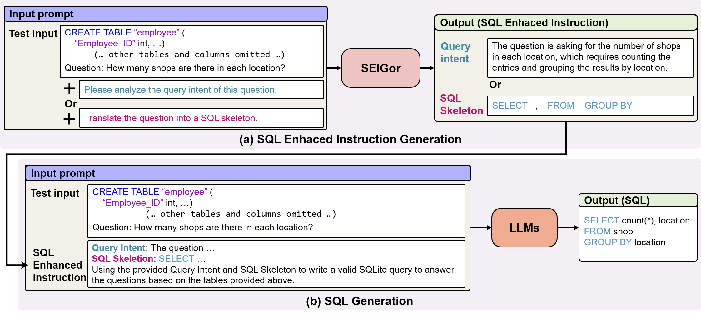

# :mag_right: SEI-SQL

<div align="center"></div>

## :dizzy:Overview
**SEI-SQL** is a text-to-SQL prompting method based on the instruction-following capabilities of large language models. SEI-SQL is divided into two stages: SQL enhanced instruction (SEI) generation and SQL generation. 
SEI-SQL achieves competitive performance with execution accuracy of 85.1% and 61.0% on the Spider and BIRD benchmarks, respectively.

## :rocket:Quick Start

### Prepare Dataset

Download [Spider](https://yale-lily.github.io/spider) and [Bird](https://bird-bench.github.io/) dataset to `./dataset/spider` and `./dataset/bird`, respectively.

### Download Model

We fine-tuned SEIGor using [LLaMa-Factory](https://github.com/hiyouga/LLaMA-Factory), and detailed information will be available soon.

You can download the [checkpoint](https://drive.google.com/file/d/1BAUoiTR4_WSiKGdHNvHgGgH7PGCLcIyW/view?usp=sharing) to `./SEIGor` directly for use.

### SEI Generation 

Run the following command to generate SEI for the Bird dataset

```
python ./sei_generation.py --database bird
```

This script processes the dataset to create SEI that will be used in the next stage for SQL generation

### SQL Generation 

Use the generated SEI to produce SQL queries by running:

```
python ./sql_generation.py --data_list_path ./dataset/bird.dev.dev.json --sei_path ./results/sei/bird_sei.json --url LLMs_url --key your_LLMs_key --model_name gpt-4o --database bird
```
